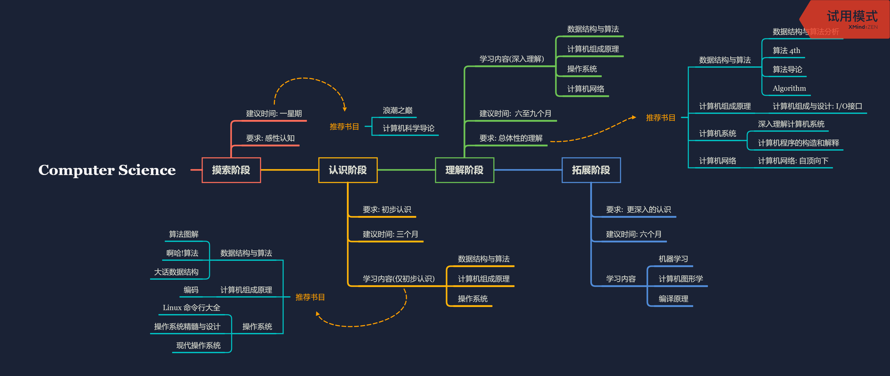

# 计算机科学 学习路线

## 内容解答

### 摸索阶段

本阶段面向对计算机科学完全不了解的同学. 在学习完本阶段以后, 将了解如下内容:

1. 计算机发展史
2. 计算机科学核心内容

#### 摸索阶段 具体学习内容

- 快速阅读 浪潮之巅 上下册, 对计算机的发展史有基础了解.
- 大致扫读一遍 计算机科学导论 , 对计算机科学核心内容有感性的认识

### 认识阶段

本阶段面向对计算机科学仅有道听途说的了解, 从未接受正规训练的同学. 在学习完本阶段以后, 将了解如下内容:

1. 理解算法的概念, 能编写简单的排序算法
2. 对常见计算机的结构有一定认识, 理解计算机工作原理.
3. 对操作系统的工作流程有一定认知, 了解内存管理机制.

总体来说, 就是熟悉了计算机科学中常见的名词.

#### 认识阶段 具体学习内容

- 扫读 算法图解 or 啊哈!算法 和 大话数据结构 . 明白算法的概念, 了解简单的一些数据结构和若干排序算法.
- 扫读 编码 , 并尝试自行组装一台计算机. 掌握计算机进行数据传输的方式, 明白主流计算机的结构.
- 为自己组装的计算机安装 Linux 系统(推荐 Deepin), 学习基础的终端操作. 为日后计算机操作打下基础.
- 扫读 操作系统精髓与设计(推荐) 或者 现代操作系统, 略去不明白的部分. 对操作系统的知识有大概的了解即可.

### 理解阶段
