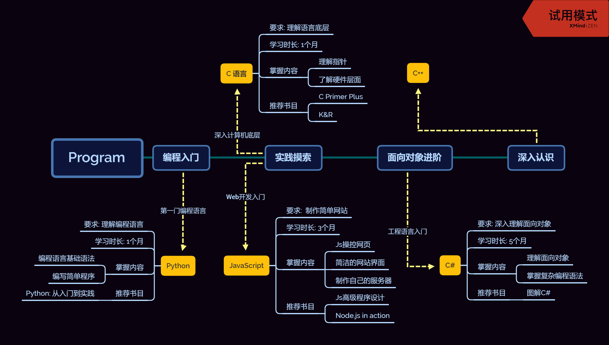

# 程序设计 学习路线

## 学习路线推荐

1. Python
2. C / JavaScript (并行学习)
3. C# / Java (二者选一)
4. C++
5. Lisp

## 前言

程序设计和计算机科学的学习是并行的. 一个是实践, 一个是理论. 程序设计要学习的语言, 都对应着若干个计算机科学的理论科目, 二者结合理解会容易许多.

## Python

Python 是一门易上手的编程语言. 该部分内容面向完全没有编程经验的新人. 通过 Python 的学习掌握编程语法, 并能够做出若干辅助工作的小程序.
